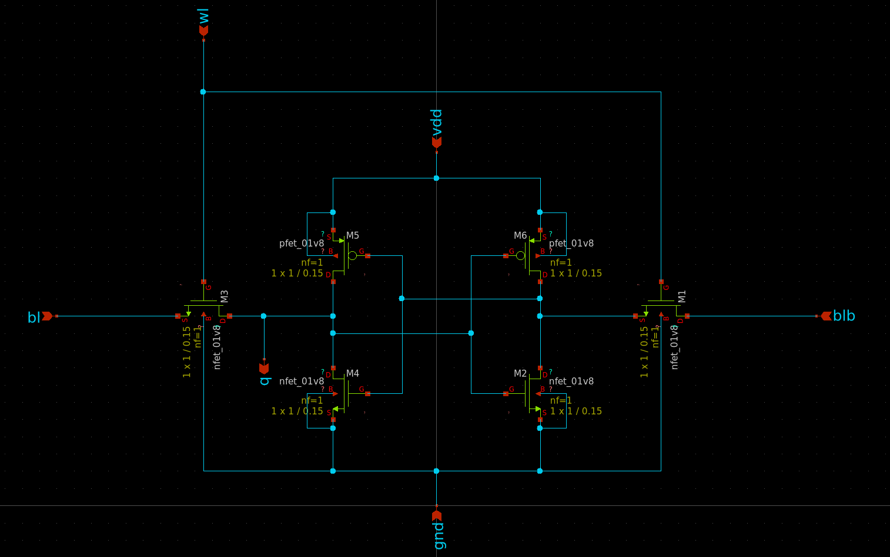
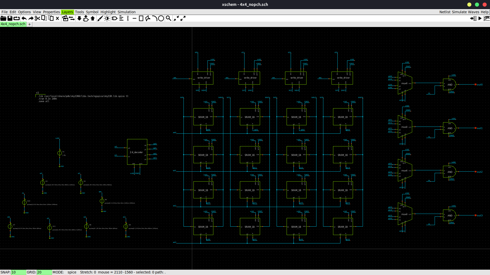
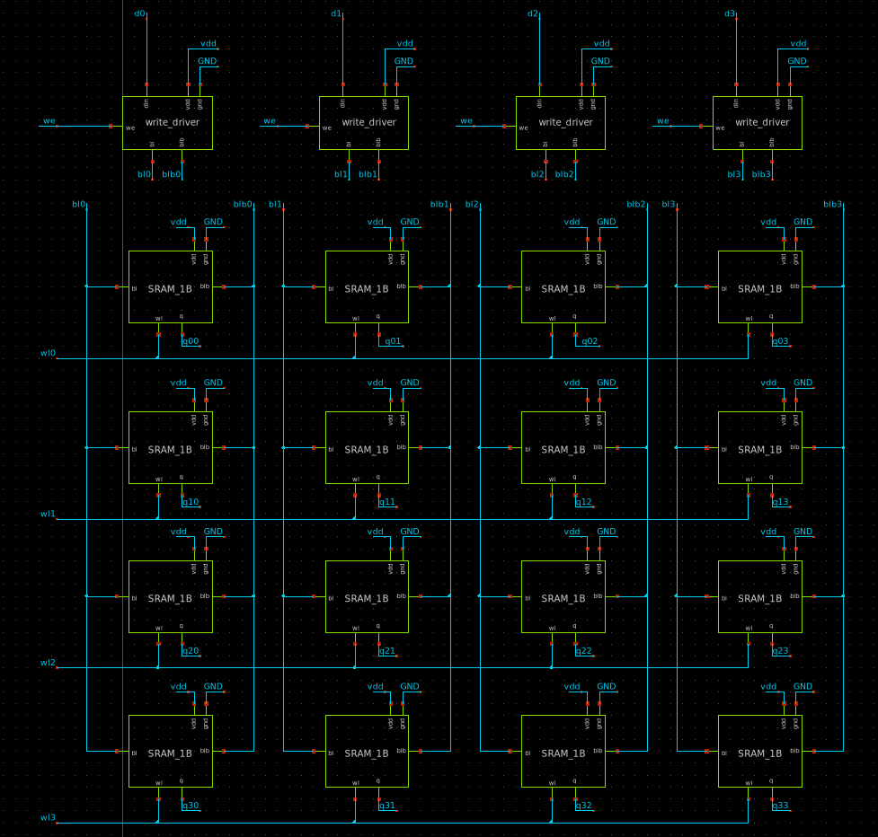
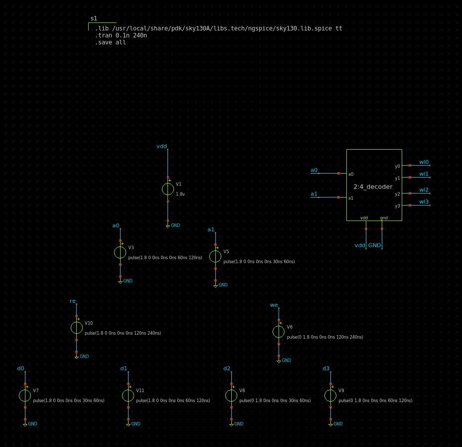
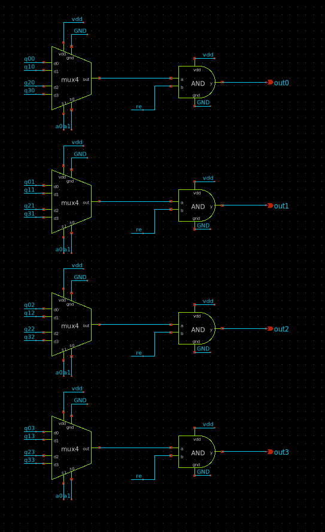
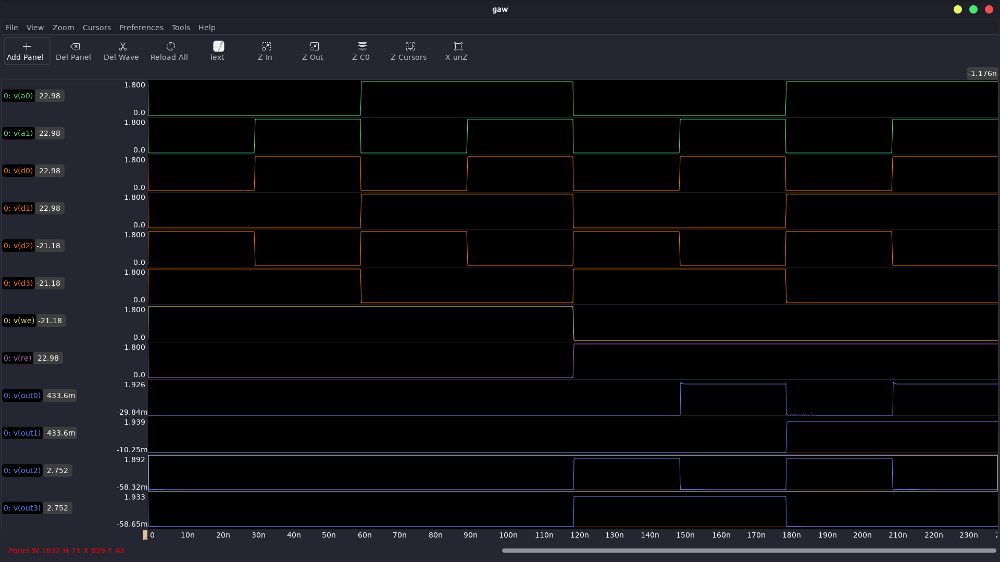

# 4x4 SRAM Array using a 6T SRAM Cell

This repository demonstrates the design and simulation of a 4x4 SRAM (Static Random Access Memory) array using a 6T SRAM cell. The design utilizes open-source tools and the SkyWater 130nm CMOS technology PDK.

---

## Overview

### Key Features:
- **4x4 SRAM Array**: Designed using a 6T SRAM cell configuration.
- **Open-source Tools**: 
  - **[xschem](https://xschem.sourceforge.io/stefan/)** for schematic capture.
  - **[ngspice](http://ngspice.sourceforge.net/)** for circuit simulation.
- **SkyWater 130nm PDK**: Used for all circuit designs.

---

## Project Components

### **1. Single 6T SRAM Cell**
A 6T SRAM cell is the basic building block for the array. Below is the circuit schematic:

### **2. 4x4 SRAM Array**
The 4x4 array is constructed by combining multiple 6T SRAM cells. The array structure and key components are shown below:

- **4x4 Array Layout:**
  

- **Write Drivers and Array:**
  

- **Input Signals and Address decoder:**
  

- **Output Selecting Multiplexers:**
  

### **3. Output Waveforms**
Waveforms showcasing the read and write operations of the SRAM array:

---

## Tools and Technologies

### **1. xschem**
[xschem](https://xschem.sourceforge.io/stefan/) is used for schematic design and hierarchy creation.

### **2. ngspice**
[ngspice](http://ngspice.sourceforge.net/) is employed for circuit simulation to analyze the performance of the SRAM array.

### **3. SkyWater 130nm PDK**
The [SkyWater 130nm PDK](https://github.com/google/skywater-pdk) provides the necessary libraries and models for circuit design and simulation in a 130nm CMOS technology node.

---

## Acknowledgments
- [SkyWater 130nm PDK](https://github.com/google/skywater-pdk)
- [xschem](https://xschem.sourceforge.io/stefan/)
- [ngspice](http://ngspice.sourceforge.net/)

  
